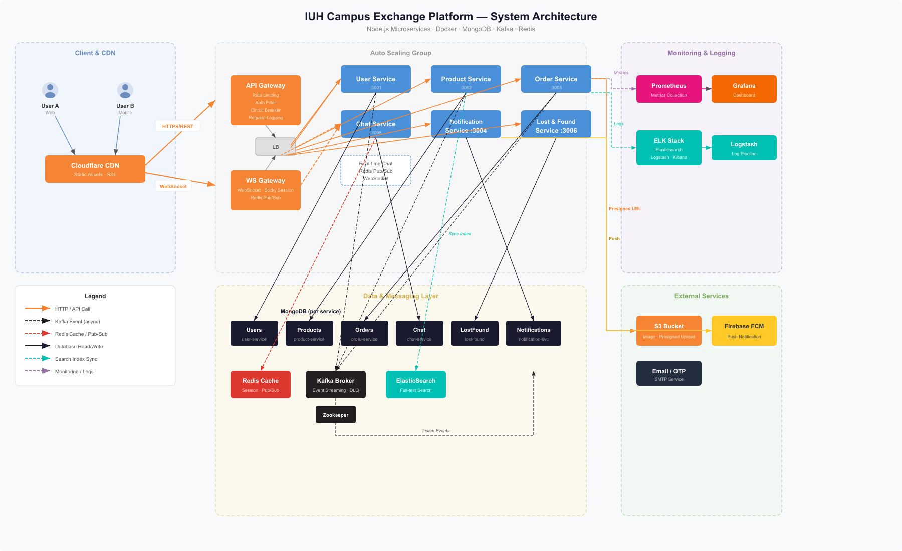

# IUH Campus Exchange Platform

Nền tảng mua bán, trao đổi đồ cũ, chat realtime và quản lý đồ thất lạc cho cộng đồng sinh viên IUH. Repo hiện tại là monorepo gồm backend microservices Node.js, frontend React/Vite và cấu hình hạ tầng Docker/Kubernetes.

## Tổng quan tính năng

- Đăng ký, đăng nhập, OTP email, refresh token bằng HttpOnly cookie.
- Quản lý hồ sơ, xác minh sinh viên, avatar, karma và phân quyền admin/moderator.
- Đăng bán sản phẩm, kiểm duyệt sản phẩm, tìm kiếm Elasticsearch, gợi ý, wishlist, lịch sử xem, theo dõi seller.
- Offer/checkout, tạo đơn hàng, xác nhận/từ chối/hủy đơn, handover, dispute, no-show, payment issue và receipt.
- Review sản phẩm/seller sau giao dịch.
- Chat realtime bằng SockJS/STOMP, upload ảnh chat, báo cáo tin nhắn và AI assistant dùng Gemini.
- Lost & Found có OCR/image processing, matching, claim, moderation, report và heatmap.
- Notification in-app, WebSocket, email, Firebase FCM, notification preferences và DLQ retry.
- Metrics Prometheus, dashboard Grafana, logging tùy chọn qua Logstash/Kibana.

## Kiến trúc hiện tại

```text
React/Vite frontend (:5173)
        |
        | REST /api/v1
        v
API Gateway (:8080) ---- WebSocket /ws ---- WS Gateway (:3007)
        |
        +-- User Service (:3001)          -> Supabase + Mongo audit logs
        +-- Product Service (:3002)       -> MongoDB + Elasticsearch + Kafka
        +-- Order Service (:3003)         -> Supabase + Redis + Kafka
        +-- Notification Service (:3004)  -> MongoDB + Kafka + FCM/Email
        +-- Chat Service (:3005)          -> MongoDB + SockJS/STOMP + Gemini
        +-- Lost-Found Service (:3006)    -> MongoDB + Kafka + OCR/Matching

Shared infrastructure: Redis, Kafka, Zookeeper, Elasticsearch.
Optional profiles: local MongoDB, monitoring stack, Nginx load balancer.
```



## Tech stack

| Phần | Công nghệ |
| --- | --- |
| Backend | Node.js 20+, Express, npm workspaces |
| Frontend | React 19, Vite 8, TypeScript, React Router, React Query, Zustand, Tailwind CSS 4 |
| Database | Supabase cho user/order, MongoDB cho các service còn lại và audit logs |
| Cache/Queue/Search | Redis, Apache Kafka, Zookeeper, Elasticsearch |
| Realtime | SockJS + STOMP, WebSocket gateway riêng |
| AI/OCR | Gemini API, Tesseract trained data cho lost-found |
| Upload | AWS S3 presigned URL |
| Monitoring | Prometheus, Grafana, Logstash, Kibana |
| Test | Vitest, shell smoke tests, JMeter load tests |

## Yêu cầu

- Node.js >= 20
- npm >= 10
- Docker và Docker Compose
- Git
- Tài khoản/credential cho Supabase, MongoDB Atlas hoặc local MongoDB, AWS S3, SMTP, Firebase FCM và Gemini nếu dùng đầy đủ tính năng.

## Cài đặt nhanh

```bash
git clone <repository-url>
cd IUH-Exchange_BE
npm install
cd frontend
npm install
cd ..
cp .env.example .env
```

Sau đó điền `.env`. Các biến bắt buộc/tối thiểu:

```env
JWT_SECRET=your_jwt_secret

SUPABASE_URL=...
SUPABASE_SERVICE_ROLE_KEY=...
SUPABASE_PUBLISHABLE_KEY=...

MONGODB_URI=...
PRODUCT_SERVICE_MONGO_URI=...
NOTIFICATION_SERVICE_MONGO_URI=...
CHAT_SERVICE_MONGO_URI=...
LOSTFOUND_SERVICE_MONGO_URI=...

REDIS_HOST=localhost
REDIS_PORT=6379
REDIS_PASSWORD=iuh_exchange_redis
KAFKA_BROKERS=localhost:9092
ELASTICSEARCH_NODE=http://localhost:9200

CORS_ORIGIN=http://localhost:5173,http://localhost:3000
FRONTEND_URL=http://localhost:5173
```

Các biến nên cấu hình khi dùng tính năng tương ứng:

```env
AWS_REGION=ap-southeast-1
AWS_ACCESS_KEY_ID=...
AWS_SECRET_ACCESS_KEY=...
S3_BUCKET_NAME=...

SMTP_HOST=smtp.gmail.com
SMTP_PORT=587
SMTP_USER=...
SMTP_PASS=...

FIREBASE_ADMINSDK_PATH=./firebase-adminsdk.json
# hoặc FIREBASE_PROJECT_ID / FIREBASE_PRIVATE_KEY / FIREBASE_CLIENT_EMAIL

GEMINI_API_KEY=...
GEMINI_MODEL=gemini-2.5-flash
PRODUCT_MODERATION_MODEL=gemini-2.5-flash

GATEWAY_SECRET=...
INTERNAL_SERVICE_TOKEN=...
INTERNAL_API_KEY=...
```

## Chạy ở môi trường development

### Cách 1: Dùng MongoDB Atlas/Supabase và Docker cho hạ tầng phụ

Lệnh này khởi động Redis, Zookeeper, Kafka, Elasticsearch bằng Docker, sau đó chạy toàn bộ backend service bằng `concurrently`.

```bash
npm run dev
```

### Cách 2: Dùng local MongoDB container

```bash
npm run dev:local
```

Lệnh này bật thêm profile `local-db` trong `docker-compose.yml`.

### Chạy từng backend service

```bash
npm run dev:gateway       # API Gateway :8080
npm run dev:user          # User Service :3001
npm run dev:product       # Product Service :3002
npm run dev:order         # Order Service :3003
npm run dev:notification  # Notification Service :3004
npm run dev:chat          # Chat Service :3005
npm run dev:lostfound     # Lost & Found Service :3006
npm run dev --workspace=packages/ws-gateway  # WS Gateway :3007
```

### Chạy frontend

```bash
cd frontend
npm run dev
```

Frontend mặc định chạy tại `http://localhost:5173`, gọi API qua `http://localhost:8080/api/v1` và WebSocket qua `http://localhost:8080/ws`. Có thể override bằng:

```env
VITE_API_URL=http://localhost:8080/api/v1
VITE_WS_URL=http://localhost:8080/ws
```

## Docker Compose

Chạy hạ tầng dev và publish port ra localhost:

```bash
docker compose -f docker-compose.yml -f docker-compose.dev.yml up -d redis zookeeper kafka elasticsearch
```

Chạy thêm MongoDB local:

```bash
docker compose -f docker-compose.yml -f docker-compose.dev.yml --profile local-db up -d mongodb redis zookeeper kafka elasticsearch
```

Chạy full backend container:

```bash
docker compose -f docker-compose.yml -f docker-compose.dev.yml up -d --build
```

Monitoring:

```bash
docker compose -f docker-compose.yml -f docker-compose.dev.yml --profile monitoring up -d
```

Các port dev chính:

| Service | Port |
| --- | --- |
| API Gateway | 8080 |
| User | 3001 |
| Product | 3002 |
| Order | 3003 |
| Notification | 3004 |
| Chat | 3005 |
| Lost & Found | 3006 |
| WS Gateway | 3007 |
| Frontend | 5173 |
| Redis | 6379 |
| Kafka | 9092 |
| Elasticsearch | 9200 |
| Prometheus | 9090 |
| Grafana | 3100 |
| Kibana | 5601 |

## API qua Gateway

Gateway mount các route dưới prefix `http://localhost:8080/api/v1`.

| Nhóm | Prefix | Ghi chú |
| --- | --- | --- |
| Auth | `/auth` | Public: register, verify/resend OTP, login, refresh, forgot/reset password; một số route cần token như logout/change-password |
| Users | `/users` | Profile, avatar presign, student verification, karma history, delete account |
| Admin | `/admin` và `/users/admin` | User moderation, role/permissions, ban/unban, audit logs, stats |
| Products | `/products` | Public GET list/search/suggestions/detail; mutation cần token và quyền |
| Product admin | `/products/admin` | Duyệt/xóa sản phẩm, danh sách pending, stats |
| Offers | `/products/:productId/offers`, `/products/offers/*` | Tạo/list/resolve/withdraw offer, checkout nội bộ |
| Reviews | `/products/:productId/reviews`, `/products/seller/:userId/reviews` | Review sản phẩm/seller |
| Wishlist & trust | `/products/*/wishlist`, `/products/sellers/*`, `/products/me/history` | Wishlist, trust profile, follow seller, view history |
| Orders | `/orders` | CRUD order, confirm/reject/cancel, admin list/stats, receipt, review eligibility |
| Payments | `/orders/:id/payment*` | Create/callback/bank transfer/refund/payment detail |
| Chat | `/chat` | Messages, conversations, read state, search, upload URL, report/admin reported messages, AI assistant |
| Notifications | `/notifications` | List/read/delete/unread count, admin email compose |
| FCM | `/notifications/fcm/*` | Register/unregister/test/subscribe topic |
| Preferences | `/notifications/preferences` | Get/update notification preferences |
| DLQ | `/notifications/dlq` | List/retry/delete failed notification events |
| Lost & Found | `/lost-found` | List/detail/create/update/delete, upload URL, match preview, matches, claim/review claim |
| Lost & Found admin | `/lost-found/admin*` | Admin list, heatmap, bulk moderate, delete |
| Reports | `/reports` | Create report, my reports, admin resolve |

Health và metrics của từng service:

```bash
curl http://localhost:8080/health
curl http://localhost:3001/health
curl http://localhost:3001/metrics
```

## WebSocket

Frontend dùng SockJS/STOMP tại:

```text
http://localhost:8080/ws
```

Khi chạy trực tiếp chat service hoặc ws-gateway:

```text
http://localhost:3005/ws
http://localhost:3007/ws
```

Các destination chính đang được frontend/service dùng gồm gửi tin nhắn, ảnh, trạng thái đọc, typing/presence, nhận tin nhắn riêng và notification theo user.

## Cấu trúc thư mục

```text
IUH-Exchange_BE/
├── packages/
│   ├── common/                 # config, auth, audit, cache, dto, exceptions, logger, metrics
│   ├── api-gateway/            # reverse proxy, auth filter, rate limit, circuit breaker
│   ├── user-service/           # auth, users, admin, karma, Supabase user data
│   ├── product-service/        # products, offers, reviews, wishlist, trust, Elasticsearch
│   ├── order-service/          # orders, payments, saga, Supabase order data
│   ├── notification-service/   # notifications, FCM, email, preferences, DLQ
│   ├── chat-service/           # REST chat, SockJS/STOMP, upload, AI assistant
│   ├── lost-found-service/     # lost-found, OCR, matching, claims, reports
│   └── ws-gateway/             # WebSocket gateway and internal notification endpoints
├── frontend/                   # React/Vite TypeScript app
├── infra/                      # Mongo init, Nginx, monitoring, ELK, JMeter
├── k8s/                        # Kubernetes base manifests
├── tests/                      # smoke, integration helper scripts, load tests
├── supabase/                   # Supabase schema for users/orders
├── scripts/                    # migration scripts
├── docker-compose.yml
├── docker-compose.dev.yml
└── package.json
```

## Tests và kiểm tra

```bash
npm test
npm run test:watch
npm run test:coverage
npm run lint
```

Một số script kiểm thử tích hợp/smoke:

```bash
bash tests/quick-test.sh
bash tests/test-api.sh
node tests/test-services.js
node tests/full-api-test.js
```

Load test:

```bash
cd tests/load
# Mở api-load-test.jmx hoặc infra/jmeter/load-test.jmx bằng JMeter
```

## Supabase migration

Repo có script chuyển dữ liệu user/order từ MongoDB sang Supabase:

```bash
npm run migrate:supabase:users-orders
```

Yêu cầu `.env` có:

```env
SUPABASE_URL=...
SUPABASE_SERVICE_ROLE_KEY=...
USER_SERVICE_MONGO_URI=...
ORDER_SERVICE_MONGO_URI=...
```

Schema liên quan nằm ở `supabase/schema-users-orders.sql`; ghi chú migration nằm ở `docs/SUPABASE_MIGRATION.md`.

## Bảo mật và vận hành

- `JWT_SECRET` là biến bắt buộc, service sẽ dừng nếu thiếu.
- Gateway hỗ trợ CORS, rate limit Redis-backed, request logging và circuit breaker.
- Service-to-service có HMAC/gateway signature và internal token/key ở một số luồng.
- Refresh token được lưu bằng HttpOnly cookie; frontend giữ access token để gửi Bearer token.
- Admin/moderator route dùng RBAC/permissions từ user service.
- Upload ảnh dùng presigned URL thay vì proxy file qua backend.
- Không commit `.env`, Firebase Admin SDK JSON, credential Supabase/AWS/SMTP/Gemini.

## Deployment

Build và chạy bằng Docker Compose:

```bash
docker compose build
docker compose up -d
```

Nginx load balancer và Certbot nằm trong profile `lb`:

```bash
docker compose --profile lb up -d nginx-lb certbot
```

Kubernetes manifests nằm trong `k8s/base`:

```bash
kubectl apply -k k8s/base
```

## Tài liệu liên quan

- `DOCKER_SETUP.md`: Ghi chú cấu hình Docker.
- `system_design.md`: Thiết kế hệ thống tổng quan.
- `PHASE1_ANALYSIS.md`, `plan.md`, `project_checklist.md`: Tài liệu phân tích và danh sách công việc phát triển.
- [API_REFERENCE_GUIDE.md](file:///d:/D%E1%BB%AF%20li%E1%BB%87u/HK2_Nam4/BTnhomKTTKHT/IUH-Exchange_BE/docs/API_REFERENCE_GUIDE.md): Tài liệu hướng dẫn chi tiết toàn bộ API, Request/Response Schema và mã lỗi.
- [DEVELOPER_HANDBOOK.md](file:///d:/D%E1%BB%AF%20li%E1%BB%87u/HK2_Nam4/BTnhomKTTKHT/IUH-Exchange_BE/docs/DEVELOPER_HANDBOOK.md): Cẩm nang lập trình viên (Kiến trúc Microservices, quy trình Saga, cơ chế Circuit Breaker, Logging ELK, v.v.).
- [TESTING_PLAYBOOK.md](file:///d:/D%E1%BB%AF%20li%E1%BB%87u/HK2_Nam4/BTnhomKTTKHT/IUH-Exchange_BE/docs/TESTING_PLAYBOOK.md): Hướng dẫn kiểm thử đơn vị, kiểm thử tích hợp và kiểm thử hiệu năng/tải qua JMeter.
- `tests/load/README.md`: Hướng dẫn cấu hình và chạy load test chi tiết.


## License

Đồ án môn Kiến trúc phần mềm - Đại học Công nghiệp TP.HCM (IUH).
