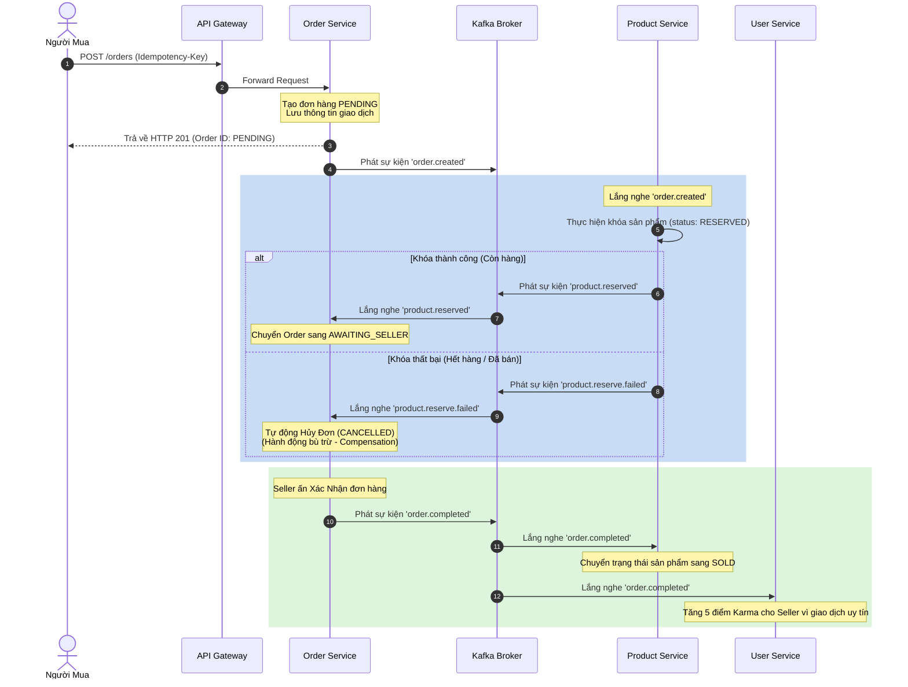

# 🛠️ Cẩm Nang Lập Trình Viên (Developer Handbook)

Chào mừng bạn đến với tài liệu hướng dẫn phát triển hệ thống **IUH Campus Exchange Platform Backend**. Tài liệu này giải thích chi tiết kiến trúc hệ thống, quy trình nghiệp vụ phức tạp, cách vận hành cục bộ và các quy chuẩn viết code cần tuân thủ.

---

## 🏛️ 1. Thiết Kế Hệ Thống & Kiến Trúc Microservices

Hệ thống được thiết kế theo mô hình **Microservices** hướng sự kiện (Event-Driven Architecture) với kiến trúc monorepo sử dụng **npm workspaces**.

```
                         ┌─────────────────┐
                         │   React Web     │
                         └────────┬────────┘
                                  │
                         ┌────────▼────────┐
                         │   API Gateway   │ (Cổng tiếp nhận REST API công khai)
                         └────────┬────────┘
                                  │
     ┌────────────────────────────┼────────────────────────────┐
     │ (Internal REST calls)      │                            │
┌────▼────┐                  ┌────▼────┐                  ┌────▼────┐
│  User   │                  │ Product │                  │  Order  │
│ Service │                  │ Service │                  │ Service │
└────┬────┘                  └────┬────┘                  └────┬────┘
     │                            │                            │
     │                      ┌─────▼─────┐                      │
     │                      │Kafka Event│                      │
     │                      │  Broker   │                      │
     │                      └─────┬─────┘                      │
     │                            │                            │
     │                      ┌─────▼─────┐                      │
     │                      │Notif/Chat │                      │
     │                      │  Service  │                      │
     │                      └───────────┘                      │
     └────────────────────────────┼────────────────────────────┘
                            ┌─────▼─────┐
                            │ Databases │ (MongoDB, Redis, ES)
                            └───────────┘
```

### Các Core Services và Cổng kết nối (Port Mapping)
1. **api-gateway** (Port `8080`): Cửa ngõ duy nhất đón nhận HTTP request của Client, chịu trách nhiệm xác thực JWT tập trung, định tuyến (proxy) tới các service con, áp dụng Rate Limiting và Circuit Breaker.
2. **ws-gateway** (Port `3007`): Cửa ngõ quản lý kết nối Socket realtime qua giao thức STOMP, định tuyến tin nhắn tới Chat Service và quản lý trạng thái kết nối của các Client.
3. **user-service** (Port `3001`): Quản lý đăng ký, gửi OTP, đăng nhập, phân quyền (RBAC), cập nhật hồ sơ cá nhân và hệ thống tính điểm Karma.
4. **product-service** (Port `3002`): Quản lý tin đăng bán sản phẩm, tích hợp tìm kiếm ElasticSearch, đồng bộ hóa danh mục và duyệt tin của quản trị viên.
5. **order-service** (Port `3003`): Quản lý vòng đời đơn hàng và điều phối quy trình giao dịch phân tán Saga.
6. **notification-service** (Port `3004`): Lắng nghe các sự kiện từ Kafka để đẩy Email OTP, In-app Notification và Push Notification qua FCM.
7. **chat-service** (Port `3005`): Lưu trữ lịch sử chat, tải lên hình ảnh hội thoại và hỗ trợ kết nối STOMP.
8. **lost-found-service** (Port `3006`): Đăng tin tìm đồ rơi, đối sánh tự động dựa trên AI Text & Image matching.
9. **common**: Thư viện dùng chung chứa các middleware (error-handler, auth-validator), helper kết nối cơ sở dữ liệu (Mongo, Redis, Kafka) và định dạng phản hồi chuẩn.

---

## 🔄 2. Các Cơ Chế Nâng Cao & Giao Dịch Phân Tán (Saga)

Để đảm bảo tính toàn vẹn dữ liệu giữa các microservices có database độc lập, hệ thống áp dụng mô hình **Saga Choreography** qua Apache Kafka.

### Sơ Đồ Luồng Saga Tạo Đơn Hàng (Saga Choreography Flow)



### Chi tiết các sự kiện Kafka (Kafka Event Schemas)

#### Sự kiện: `order.created`
Được phát ra bởi `Order Service` khi người dùng gửi yêu cầu đặt mua.
```json
{
  "eventId": "uuid-v4-string",
  "eventType": "ORDER_CREATED",
  "timestamp": "2026-06-02T07:15:00.000Z",
  "payload": {
    "orderId": "65fa8b9c0d1e2f3a4b5c6d7e",
    "productId": "65cd9e8f7a6b5c4d3e2f1a0b",
    "buyerId": "65ab1c2d3e4f5a6b7c8d9e0f",
    "price": 45000,
    "quantity": 1
  }
}
```

#### Sự kiện: `product.reserved`
Phát ra bởi `Product Service` báo hiệu đã giữ hàng thành công trong kho.
```json
{
  "eventId": "uuid-v4-string",
  "eventType": "PRODUCT_RESERVED",
  "timestamp": "2026-06-02T07:15:02.000Z",
  "payload": {
    "orderId": "65fa8b9c0d1e2f3a4b5c6d7e",
    "productId": "65cd9e8f7a6b5c4d3e2f1a0b",
    "status": "RESERVED"
  }
}
```

---

## 🔒 3. Bảo Mật & Khả Năng Chống Chịu Lỗi (Security & Resilience)

### 1. Cơ Chế Xác Thực JWT & Refresh Token an toàn
- **Access Token**: Lưu ở bộ nhớ RAM của ứng dụng Client (React state), có hiệu lực ngắn hạn (15 phút) nhằm hạn chế rủi ro lộ token.
- **Refresh Token**: Được Backend thiết lập vào **HttpOnly, Secure Cookie** với thuộc tính `SameSite=Strict`. Trình duyệt tự động gửi kèm cookie này khi gọi API `/refresh-token` mà mã Javascript độc hại (XSS) không thể truy cập trực tiếp.

### 2. Xác Thực Giữa Các Service (Gateway Signature)
Nhằm ngăn chặn hacker gọi trực tiếp vào cổng nội bộ của các microservice con (ví dụ bypass qua Gateway gọi thẳng vào User Service port `3001`):
- API Gateway khi chuyển tiếp yêu cầu sẽ tự động ký một chữ ký HMAC sử dụng khóa bí mật chung:
  `X-Gateway-Signature: HMAC-SHA256(SecretKey, Timestamp + URI)`
- Các microservice con sẽ dùng middleware xác thực chữ ký này, nếu không đúng hoặc quá thời gian (hạn chế replay attack), request lập tức bị từ chối với mã lỗi `403 Forbidden`.

### 3. Khả Năng Chống Chịu Lỗi (Circuit Breaker)
Để tránh tình trạng lỗi sập dây chuyền (Cascade failure) khi một service con bị ngắt kết nối (ví dụ: Product Service bị sập khiến API Gateway bị tắc nghẽn hàng ngàn kết nối đang đợi phản hồi):
- Cấu hình **Circuit Breaker** với ngưỡng: lỗi liên tục quá 5 lần trong 10 giây sẽ chuyển sang trạng thái **OPEN** (Mở mạch).
- Khi mạch OPEN, Gateway sẽ từ chối gọi vào service đang lỗi và ngay lập tức trả về phản hồi fallback lỗi `503 Service Unavailable` hoặc dữ liệu cache cũ để giải phóng tài nguyên hệ thống. Mạch sẽ tự động chuyển sang **HALF-OPEN** sau 30 giây để kiểm tra lại trạng thái phục hồi của service con.

---

## 🚀 4. Hướng Dẫn Vận Hành Cục Bộ & Gỡ Lỗi (Local Development & Troubleshooting)

### 1. Chuẩn Bị File Môi Trường `.env`
Đảm bảo bạn đã sao chép từ file ví dụ và điền đầy đủ các cấu hình kết nối. 
> [!IMPORTANT]
> Khi chạy cục bộ bằng Docker, hãy chắc chắn địa chỉ IP hoặc Hostname trong biến cấu hình khớp với các service trong Docker Network (ví dụ sử dụng `redis:6379` thay vì `localhost:6379` nếu chạy ứng dụng trong container).

### 2. Sửa Các Lỗi Kết Nối Thường Gặp

#### Lỗi: "Kafka broker may not be available"
- **Nguyên nhân**: Docker Zookeeper khởi động chậm hơn Kafka dẫn đến Kafka Broker không thể đăng ký thành công hoặc địa chỉ `KAFKA_ADVERTISED_LISTENERS` cấu hình sai.
- **Cách khắc phục**:
  1. Dừng hoàn toàn và xóa volume cũ: `docker compose down -v`.
  2. Khởi động riêng lẻ Zookeeper trước: `docker compose up -d zookeeper`.
  3. Đợi 5 giây rồi khởi động Kafka: `docker compose up -d kafka`.
  4. Kiểm tra log của Kafka: `docker compose logs kafka`.

#### Lỗi: "Elasticsearch status is Red / Out of Memory"
- **Nguyên nhân**: Elasticsearch yêu cầu dung lượng RAM ảo tối thiểu lớn để hoạt động, mặc định trên Windows/Linux có thể bị từ chối hoặc Docker thiếu RAM cấp phát.
- **Cách khắc phục**:
  - Trên Windows chạy Docker Desktop: Vào Settings -> Resources -> Nâng dung lượng Memory lên tối thiểu `4GB`.
  - Trên Linux, tăng chỉ số `max_map_count` của nhân hệ điều hành:
    ```bash
    sudo sysctl -w vm.max_map_count=262144
    ```

#### Lỗi: "MongoDB connection timeout"
- **Nguyên nhân**: Chạy chế độ `local-db` nhưng chưa khởi tạo user/password đúng hoặc tường lửa chặn cổng `27017`.
- **Cách khắc phục**:
  - Kiểm tra xem các biến `MONGO_ROOT_USERNAME` và `MONGO_ROOT_PASSWORD` trong file `.env` đã trùng khớp với file cấu hình khởi tạo của Mongo nằm trong thư mục [init-mongo.js](file:///d:/D%E1%BB%AF%20li%E1%BB%87u/HK2_Nam4/BTnhomKTTKHT/IUH-Exchange_BE/infra/mongo/init-mongo.js) chưa.

---

## 📊 5. Hệ Thống Thu Thập Log & Giám Sát (Logging & Monitoring)

### 1. Centralized Logging (ELK Stack)
- **Logstash**: Đọc log xuất ra dưới định dạng JSON từ console của các microservice.
- **Elasticsearch**: Lưu trữ chỉ mục (index) và phân tích các dòng log.
- **Kibana**: Cung cấp giao diện trực quan hóa thông tin lỗi.
- **Request Tracing**: Mỗi request đi vào hệ thống qua Gateway sẽ được đính kèm một mã định danh duy nhất `correlation-id` trong Header. Mã này được truyền qua toàn bộ luồng gọi REST API nội bộ hoặc đẩy lên sự kiện Kafka. Nhờ đó, lập trình viên chỉ cần tìm kiếm `correlation-id` trên Kibana là có thể truy vết toàn bộ hành trình xử lý của yêu cầu đó qua nhiều service khác nhau.

### 2. Prometheus & Grafana Metrics
Mỗi microservice expose một endpoint `/metrics` định dạng dữ liệu cho Prometheus. Các chỉ số được giám sát bao gồm:
- `http_requests_total`: Tổng số request HTTP đã xử lý theo method và trạng thái phản hồi.
- `http_request_duration_seconds`: Thời gian phản hồi của các API.
- `process_cpu_seconds_total` & `process_resident_memory_bytes`: Hiệu năng tiêu thụ tài nguyên phần cứng của NodeJS runtime.
- **Grafana Dashboard**: Import file cấu hình dashboard trong thư mục `infra/monitoring/grafana` để xem biểu đồ trực quan về lượng request/giây (RPS), tỉ lệ lỗi hệ thống, thời gian phản hồi trung bình của hệ thống theo thời gian thực.

---

## 📝 6. Quy Quy Chuẩn Commit & Viết Code (Coding & Git Conventions)

### 1. Quy chuẩn Đặt Tên Nhánh (Git Branching)
- Nhánh tính năng mới: `feature/ten-tinh-nang` hoặc `feat/ten-tinh-nang`
- Nhánh sửa lỗi: `fix/ten-loi`
- Nhánh tài liệu: `docs/ten-tai-lieu`
- Nhánh tối ưu hiệu năng: `refactor/ten-thanh-phan`

### 2. Quy chuẩn Viết Commit Message (Conventional Commits)
Thông điệp commit bắt buộc tuân theo định dạng chuẩn để tự động tạo Changelog khi release:

`<type>(<scope>): <description>`

- **type**:
  - `feat`: Thêm một tính năng mới cho hệ thống.
  - `fix`: Sửa lỗi của hệ thống.
  - `docs`: Chỉnh sửa hoặc thêm mới tài liệu hướng dẫn.
  - `style`: Định dạng code (khoảng trắng, dấu chấm phẩy, thụt dòng...) không ảnh hưởng logic.
  - `refactor`: Tái cấu trúc mã nguồn nhưng không thay đổi hành vi nghiệp vụ.
  - `test`: Thêm mới hoặc cập nhật các bộ kiểm thử tự động.
  - `chore`: Cập nhật cấu hình build, dependencies gói thư mục (ví dụ sửa file package.json).
- **scope** (tùy chọn): Tên service bị ảnh hưởng (ví dụ `order`, `product`, `auth`).
- **Ví dụ**:
  - `feat(order): tích hợp sự kiện Kafka order.created vào luồng Saga`
  - `fix(auth): sửa lỗi không nhận diện được Token hết hạn trong HttpOnly Cookie`
  - `docs(readme): bổ sung tài liệu hướng dẫn khởi chạy cơ sở dữ liệu Elasticsearch`
