# IUH Exchange Class Diagram

This diagram focuses on the main domain models used by IUH Exchange:
users, marketplace listings, orders, disputes, chat, reports, lost-and-found,
notifications, karma, and audit logging.

If you need straight, non-curved connector lines, use the PlantUML version:
[`docs/class-diagram.puml`](./class-diagram.puml). It uses `skinparam linetype ortho`.

```mermaid
classDiagram
direction LR

class User {
  +String id
  +String email
  +String passwordHash
  +String name
  +String studentId
  +String avatarUrl
  +Boolean isVerified
  +Boolean isActive
  +Number karmaPoint
  +String role
  +String[] permissions
  +Object studentVerification
  +Object bankInfo
  +Boolean adminTwoFactorEnabled
}

class KarmaHistory {
  +String id
  +String userId
  +String type
  +Number points
  +String reason
  +String relatedId
  +Object metadata
}

class Product {
  +String id
  +String sellerId
  +String title
  +String description
  +Number price
  +String listingType
  +String tradeWanted
  +Boolean allowOffers
  +String[] imageUrls
  +String category
  +String location
  +String condition
  +String status
  +String reservedOrderId
  +String reservedBy
  +Date reservationExpiresAt
  +Object aiModeration
}

class Offer {
  +String id
  +String productId
  +String buyerId
  +String sellerId
  +String type
  +Number amount
  +String tradeItemTitle
  +String message
  +String status
  +Number counterAmount
  +Date expiresAt
  +Date resolvedAt
}

class Order {
  +String id
  +String buyerId
  +String sellerId
  +String productId
  +String offerId
  +Number price
  +String listingType
  +String status
  +String buyerNote
  +String handoverStatus
  +String paymentStatus
  +String paymentMethod
  +String paymentTransactionId
  +String disputeStatus
  +String disputeReason
  +String disputeResolution
  +String disputeOutcome
  +String disputeRemedy
  +Object disputeSanctions
  +Object[] statusHistory
  +Object[] transactions
}

class DisputeEvidence {
  +String id
  +String submittedBy
  +String type
  +String url
  +String note
  +Date createdAt
}

class DisputeTimeline {
  +String id
  +String action
  +String actorId
  +String actorRole
  +String note
  +Object metadata
  +Date createdAt
}

class Review {
  +String id
  +String productId
  +String orderId
  +String buyerId
  +String sellerId
  +Number rating
  +String comment
}

class Wishlist {
  +String id
  +String userId
  +String productId
}

class ProductView {
  +String id
  +String userId
  +String productId
  +String sellerId
  +Date viewedAt
}

class SellerFollow {
  +String id
  +String followerId
  +String sellerId
}

class ChatMessage {
  +String id
  +String senderId
  +String receiverId
  +String conversationId
  +String content
  +String messageType
  +String fileUrl
  +String fileName
  +Object productContext
  +Boolean isRead
  +Boolean reported
  +String moderationStatus
  +Object[] reports
}

class LostFoundItem {
  +String id
  +String userId
  +String type
  +String title
  +String description
  +String[] images
  +String location
  +String contactInfo
  +String category
  +String[] tags
  +String verificationQuestion
  +String status
  +String approvedClaimId
  +String analysisStatus
  +String detectedType
  +Number analysisConfidence
  +Object extracted
  +Object analysisMetadata
}

class Claim {
  +String id
  +String claimantId
  +String answer
  +String[] evidenceUrls
  +String status
  +String ownerNote
  +Date reviewedAt
}

class Report {
  +String id
  +String reporterId
  +String targetType
  +String targetId
  +String reason
  +String status
  +String adminNote
}

class ConsentLog {
  +String id
  +String userId
  +String itemId
  +String consentType
  +Boolean granted
  +String ipAddress
  +String userAgent
}

class Notification {
  +String id
  +String recipientId
  +String title
  +String message
  +String type
  +String targetId
  +String link
  +Boolean isRead
}

class NotificationPreference {
  +String id
  +String userId
  +Object email
  +Object push
  +Object inApp
}

class FcmToken {
  +String id
  +String userId
  +String token
  +String deviceType
  +String deviceName
  +Boolean isActive
  +Date lastUsedAt
}

class AuditLog {
  +String id
  +String userId
  +String action
  +String resource
  +String resourceId
  +String method
  +String path
  +String ip
  +String userAgent
  +Number statusCode
  +Object metadata
}

class DlqEvent {
  +String id
  +String topic
  +Object payload
  +String error
  +Number retryCount
  +String status
}

User "1" --> "0..*" Product : sells
User "1" --> "0..*" Order : buys
User "1" --> "0..*" Order : sells
Product "1" --> "0..*" Offer : receives
User "1" --> "0..*" Offer : makes
Offer "0..1" --> "0..1" Order : accepted_checkout
Product "1" --> "0..*" Order : ordered_as
Order "1" --> "0..*" DisputeEvidence : has
Order "1" --> "0..*" DisputeTimeline : records

Order "1" --> "0..1" Review : reviewed_by_buyer
Product "1" --> "0..*" Review : reviews
User "1" --> "0..*" Review : writes
User "1" --> "0..*" Review : receives

User "1" --> "0..*" Wishlist : saves
Product "1" --> "0..*" Wishlist : saved_by
User "1" --> "0..*" ProductView : views
Product "1" --> "0..*" ProductView : viewed
User "1" --> "0..*" SellerFollow : follows
User "1" --> "0..*" SellerFollow : followed_seller

User "1" --> "0..*" ChatMessage : sends
User "1" --> "0..*" ChatMessage : receives
Product "0..1" --> "0..*" ChatMessage : product_context

User "1" --> "0..*" LostFoundItem : posts
LostFoundItem "1" --> "0..*" Claim : claims
User "1" --> "0..*" Claim : submits
LostFoundItem "1" --> "0..*" ConsentLog : consent_records
User "1" --> "0..*" ConsentLog : grants

User "1" --> "0..*" Report : reports
Report "0..*" --> "0..1" User : target_user
Report "0..*" --> "0..1" Product : target_product
Report "0..*" --> "0..1" LostFoundItem : target_lost_found

User "1" --> "0..*" Notification : receives
User "1" --> "0..1" NotificationPreference : configures
User "1" --> "0..*" FcmToken : devices
User "1" --> "0..*" KarmaHistory : karma_events
User "1" --> "0..*" AuditLog : performs
DlqEvent ..> Notification : failed_event
```

## Notes

- `User`, `Order`, and `KarmaHistory` are represented through the shared `SupabaseModel` abstraction.
- Most other domain objects are Mongoose models.
- `Order` contains embedded dispute, payment, handover, transaction, and status-history arrays. The diagram extracts dispute evidence and dispute timeline as conceptual classes to make the dispute flow readable.
- `Report.targetId` is polymorphic. Its target is decided by `targetType`: `USER`, `PRODUCT`, or `LOST_FOUND`.
- `ChatMessage.productContext` is embedded data, not a hard database reference, but it points conceptually to a product conversation.
