# Tài Liệu Đặc Tả & Cẩm Nang Thuyết Trình: Luồng Tạo Đơn Hàng (Create Order)
> **Hệ thống**: Sàn trao đổi đồ dùng sinh viên IUH-Exchange (Kiến trúc Microservices - Saga Choreography)  
> **Tài liệu học tập và bảo vệ đồ án / báo cáo môn học**

---

## PHẦN 1: ĐẶC TẢ CHI TIẾT USE CASE (USE CASE SPECIFICATION)

### 1. Thông tin chung
* **Tên Use Case**: Tạo đơn hàng (Create Order)
* **Actor chính**: Người mua (Buyer) — Sinh viên đã đăng nhập hệ thống.
* **Mô tả tóm tắt**: Cho phép người mua đặt mua hoặc trao đổi sản phẩm của người khác. Use case này áp dụng mô hình thiết kế **Saga Choreography** qua hàng đợi tin nhắn **Kafka** để quản lý trạng thái giao dịch phân tán giữa `Order Service` và `Product Service` mà không gây khóa chết dữ liệu (deadlock) hay giảm hiệu năng của hệ thống.
* **Trigger (Tác nhân kích hoạt)**: Người mua nhấn nút "Mua ngay" hoặc chấp nhận một đề xuất trao đổi hàng (Offer) trên trang chi tiết sản phẩm.

### 2. Các điều kiện (Conditions)
* **Pre-conditions (Điều kiện tiên quyết)**:
  1. Người mua đã đăng nhập thành công vào hệ thống (có JSON Web Token hợp lệ).
  2. Sản phẩm tồn tại trên hệ thống và đang ở trạng thái khả dụng để giao dịch (`status = AVAILABLE`).
  3. Người mua không phải là chủ sở hữu của sản phẩm này (`buyerId !== sellerId`).
  4. Các thành phần hạ tầng (API Gateway, Redis, Kafka, MongoDB) hoạt động bình thường.
* **Post-conditions (Điều kiện sau luồng thành công)**:
  1. Đơn hàng được lưu trữ trong MongoDB (`Order DB`) với trạng thái cuối cùng là `COMPLETED`.
  2. Sản phẩm được cập nhật trạng thái vĩnh viễn là `SOLD` trong `Product DB`.
  3. Lịch sử giao dịch được ghi lại đầy đủ làm căn cứ đối soát.
  4. Điểm uy tín (Karma points) được cộng tương ứng cho cả người mua và người bán.

---

### 3. Luồng sự kiện chính (Basic Flow / Happy Path)

#### Giai đoạn 1: Khởi tạo Đơn hàng Sơ bộ (Đồng bộ qua REST API)
1. Người mua điền các thông tin cần thiết (địa điểm bàn giao, thời gian hẹn gặp, phương thức thanh toán, ghi chú) và nhấn nút **"Đặt hàng"**.
2. Frontend tạo ra một mã bất biến chống trùng lặp (`idempotencyKey`) và gửi yêu cầu `POST /api/v1/orders` qua **API Gateway**.
3. **API Gateway** kiểm tra tính hợp lệ của token JWT, giải mã thông tin sinh viên, đính kèm vào header (`x-user-id`) và chuyển tiếp request đến **Order Service**.
4. **Order Service** tiếp nhận yêu cầu, lập tức kiểm tra `idempotencyKey` trong **Redis**:
   - Xác nhận key này chưa từng được xử lý.
   - Đặt trạng thái key trong Redis là `PROCESSING` với TTL 24 giờ nhằm ngăn chặn tuyệt đối lỗi nhấn đúp chuột gửi 2 đơn hàng trùng nhau.
5. **Order Service** thực hiện một truy vấn HTTP GET đồng bộ sang **Product Service** (`GET /api/v1/products/{productId}`) để kiểm tra thực tế:
   - Xác nhận sản phẩm có tồn tại và trạng thái của sản phẩm phải là `AVAILABLE`.
   - Lấy thông tin giá bán (`price`) và mã người bán (`sellerId`).
6. **Order Service** xác thực nghiệp vụ: kiểm tra chắc chắn mã người mua (`buyerId`) khác mã người bán (`sellerId`).
7. **Order Service** khởi tạo bản ghi đơn hàng mới trong MongoDB (`Order DB`) với trạng thái ban đầu là **`status = PENDING`**.
8. **Order Service** đẩy (publish) sự kiện `OrderCreatedEvent` vào Kafka topic **`order.created`** chứa thông tin cơ bản của đơn hàng (`orderId`, `productId`, `buyerId`, `sellerId`, `price`).
9. **Order Service** cập nhật Redis (đổi giá trị từ `PROCESSING` thành `orderId` thực tế) để lưu cache kết quả.
10. **Order Service** phản hồi HTTP Response **`201 Created`** về cho Frontend kèm thông tin đơn hàng `PENDING`.
11. Giao diện Frontend lập tức thông báo: *"Đang xử lý giữ sản phẩm..."*.

#### Giai đoạn 2: Giữ chỗ sản phẩm bất đồng bộ (Saga Choreography qua Kafka)
12. **Product Service** lắng nghe và nhận (consume) sự kiện từ Kafka topic **`order.created`**.
13. **Product Service** thực hiện truy vấn MongoDB nguyên tử (Atomic Update): Chuyển trạng thái sản phẩm từ `AVAILABLE` sang **`RESERVED`**, ghi nhận `reservedOrderId = orderId` và đặt thời gian hết hạn giữ chỗ `reservationExpiresAt = 30 phút`.
14. **Product Service** tiến hành xóa cache sản phẩm cũ trong Redis để thông tin hiển thị của trang danh sách sản phẩm được cập nhật ngay lập tức.
15. **Product Service** đẩy sự kiện xác nhận giữ chỗ thành công `ProductReservedEvent` lên Kafka topic **`product.reserved`**.
16. **Order Service** lắng nghe và nhận sự kiện từ topic **`product.reserved`**.
17. **Order Service** cập nhật trạng thái đơn hàng trong MongoDB từ `PENDING` sang **`AWAITING_SELLER`** (Đang chờ người bán xác nhận).
18. **Order Service** đẩy sự kiện `order.updated` lên Kafka để kích hoạt dịch vụ Notification gửi thông báo thời gian thực đến điện thoại/email của Người bán: *"Bạn có đơn hàng mới đang chờ xác nhận"*.
19. Giao diện người dùng của người mua cập nhật trạng thái thành *"Đặt hàng thành công! Đang chờ người bán xác nhận bàn giao"*.

#### Giai đoạn 3: Người bán xác nhận hoàn tất (Xử lý giao dịch thực tế)
20. Người mua và người bán gặp nhau trực tiếp tại trường học theo lịch hẹn, kiểm tra hàng và thực hiện trao đổi/thanh toán.
21. Người bán mở ứng dụng, nhấn nút **"Xác nhận đã bàn giao hàng & Nhận tiền"**.
22. Yêu cầu `POST /api/v1/orders/{orderId}/confirm` được gửi qua API Gateway đến **Order Service**.
23. **Order Service** xác thực người gửi yêu cầu chính là chủ sản phẩm (`sellerId`) và trạng thái đơn hàng hiện tại bắt buộc phải là `AWAITING_SELLER`.
24. **Order Service** chuyển trạng thái đơn hàng thành **`COMPLETED`** trong MongoDB và ghi nhận thời gian hoàn thành.
25. **Order Service** đẩy sự kiện `OrderCompletedEvent` lên Kafka topic **`order.completed`**.
26. **Product Service** consume sự kiện `order.completed` từ Kafka, cập nhật trạng thái vĩnh viễn của sản phẩm thành **`SOLD`** (Đã bán) và giải phóng bộ nhớ đệm cache.
27. Luồng giao dịch kết thúc thành công.

---

### 4. Luồng sự kiện rẽ nhánh và giao dịch bù trừ (Alternative & Compensation Flows)

#### Luồng A: Giữ sản phẩm thất bại do trùng lịch (Reserve Failed)
*Xảy ra khi hai người mua cùng bấm mua một sản phẩm duy nhất gần như đồng thời.*
1. Đơn hàng của Người mua 1 đã hoàn tất giai đoạn giữ chỗ và chuyển sản phẩm sang `RESERVED`.
2. Đơn hàng của Người mua 2 vẫn được tạo dưới dạng `PENDING` ở bước 7-10 (do tại thời điểm HTTP GET, sản phẩm vẫn có thể đang `AVAILABLE` hoặc do xử lý song song).
3. Khi **Product Service** xử lý sự kiện `order.created` của Người mua 2, hệ thống phát hiện trạng thái sản phẩm thực tế đã chuyển sang `RESERVED` (không còn là `AVAILABLE`).
4. **Product Service** không cập nhật sản phẩm mà đẩy ngay sự kiện lỗi **`product.reserve.failed`** lên Kafka.
5. **Order Service** consume sự kiện `product.reserve.failed`:
   - Thực hiện **Giao dịch Bù trừ (Compensating Transaction)**: Chuyển trạng thái đơn hàng của Người mua 2 từ `PENDING` thành **`CANCELLED`** với lý do *"Sản phẩm đã bị giữ chỗ bởi giao dịch khác"*.
   - Đẩy sự kiện `order.cancelled` lên Kafka để đồng bộ.
6. Frontend nhận trạng thái `CANCELLED` qua WebSocket hoặc Polling, hiển thị thông báo lỗi lên màn hình và gợi ý người mua chọn sản phẩm khác.

#### Luồng B: Người mua hủy đơn hoặc Người bán từ chối giao dịch
*Áp dụng khi đơn hàng đang ở trạng thái AWAITING_SELLER.*
1. Người mua nhấn nút **"Hủy đơn hàng"** (hoặc Người bán nhấn **"Từ chối giao dịch"**).
2. **Order Service** tiếp nhận yêu cầu, cập nhật trạng thái đơn hàng thành **`CANCELLED`** trong MongoDB.
3. **Order Service** đẩy sự kiện bù trừ **`order.cancelled`** lên Kafka.
4. **Product Service** consume sự kiện `order.cancelled` từ Kafka:
   - Thực hiện giải phóng sản phẩm: Đặt trạng thái sản phẩm quay lại **`AVAILABLE`**, đặt `reservedOrderId = null`, `reservedBy = null`, `reservedAt = null`.
   - Xóa cache cũ để hiển thị sản phẩm khả dụng trở lại trên trang chủ.

#### Luồng C: Tự động hủy do hết hạn giữ chỗ (Reservation TTL Expired)
*Đảm bảo sản phẩm không bị khóa vĩnh viễn nếu người bán "treo" đơn không xác nhận.*
1. Bản ghi sản phẩm trong MongoDB đang có `status = RESERVED` và `reservationExpiresAt = [Thời gian đặt hàng + 30 phút]`.
2. Tác vụ chạy ngầm định kỳ (Cron job) quét cơ sở dữ liệu của **Product Service** phát hiện ra sản phẩm đã quá hạn xác nhận.
3. **Product Service** tự động giải phóng sản phẩm: Chuyển `status = AVAILABLE` và xóa liên kết đơn hàng.
4. **Product Service** phát sự kiện **`product.reserve.expired`** lên Kafka.
5. **Order Service** consume sự kiện `product.reserve.expired` từ Kafka:
   - Cập nhật trạng thái đơn hàng tương ứng thành **`CANCELLED`** với lý do *"Quá thời gian 30 phút giữ chỗ mà người bán không xác nhận"*.
   - Phát sự kiện `order.cancelled` để hoàn tất quy trình hủy.

---

## PHẦN 2: MÃ NGUỒN SƠ ĐỒ SEQUENCE TỔNG HỢP (COMPREHENSIVE MERMAID CODE)

Bạn có thể sao chép đoạn mã dưới đây dán vào file Markdown `.md` trong VS Code (đã cài extension *Mermaid Editor*) để xem hoặc xuất ảnh trực quan:

```mermaid
sequenceDiagram
    autonumber
    actor Buyer as Người mua (Buyer)
    actor Seller as Người bán (Seller)
    participant Gateway as API Gateway
    participant Redis as Redis (Idempotency)
    participant OrderSvc as Order Service
    participant ProdSvc as Product Service
    participant Kafka as Kafka Broker

    %% ==========================================
    %% PHASE 1: TẠO ĐƠN HÀNG SƠ BỘ (REST HTTP)
    %% ==========================================
    rect rgb(20, 30, 50)
        note right of Buyer: PHASE 1: KHỞI TẠO ĐƠN HÀNG SƠ BỘ
        Buyer->>Gateway: POST /api/v1/orders (idempotencyKey, productId,...)
        Gateway->>OrderSvc: Chuyển tiếp request với x-user-id
        activate OrderSvc
        OrderSvc->>Redis: Check & Acquire Idempotency Key (24h TTL)
        Redis-->>OrderSvc: Key hợp lệ (Chưa tồn tại)
        
        OrderSvc->>ProdSvc: HTTP GET /api/v1/products/{productId} (Pre-check)
        ProdSvc-->>OrderSvc: 200 OK (Product Info & status = AVAILABLE)
        
        OrderSvc->>OrderSvc: Kiểm tra Buyer != Seller
        OrderSvc->>OrderSvc: Lưu đơn hàng MongoDB (status = PENDING)
        
        OrderSvc->>Kafka: Publish topic: order.created (OrderCreatedEvent)
        OrderSvc->>Redis: Cập nhật idempotencyKey -> orderId thực tế
        
        OrderSvc-->>Gateway: 201 Created (Thông tin đơn hàng PENDING)
        Gateway-->>Buyer: 201 Created (Màn hình chờ kết quả giữ chỗ)
        deactivate OrderSvc
    end

    %% ==========================================
    %% PHASE 2: GIỮ CHỖ SẢN PHẨM & PHẢN HỒI SAGA (ASYNCHRONOUS KAFKA)
    %% ==========================================
    rect rgb(30, 40, 60)
        note right of ProdSvc: PHASE 2: XỬ LÝ SAGA GIỮ CHỖ QUA KAFKA
        Kafka->>ProdSvc: Consume topic: order.created
        activate ProdSvc
        ProdSvc->>ProdSvc: Kiểm tra trạng thái Product == AVAILABLE
        
        alt Kịch bản A: Giữ chỗ thành công (Happy Path)
            ProdSvc->>ProdSvc: Cập nhật Product: status = RESERVED, reservedOrderId = orderId
            ProdSvc->>Kafka: Publish topic: product.reserved (ProductReservedEvent)
            ProdSvc->>Kafka: Publish topic: product.updated (Clear Redis Cache)
            deactivate ProdSvc
            
            Kafka->>OrderSvc: Consume topic: product.reserved
            activate OrderSvc
            OrderSvc->>OrderSvc: Cập nhật Order: status = AWAITING_SELLER
            OrderSvc->>Kafka: Publish topic: order.updated
            deactivate OrderSvc
            
        else Kịch bản B: Trùng lịch / Hết hàng (Reserve Failed)
            activate ProdSvc
            ProdSvc->>Kafka: Publish topic: product.reserve.failed
            deactivate ProdSvc
            
            Kafka->>OrderSvc: Consume topic: product.reserve.failed
            activate OrderSvc
            OrderSvc->>OrderSvc: Giao dịch bù trừ: status = CANCELLED (Lý do: Hết hàng)
            OrderSvc->>Kafka: Publish topic: order.cancelled
            deactivate OrderSvc
        end
    end

    %% ==========================================
    %% PHASE 3: KẾT THÚC VÒNG ĐỜI GIAO DỊCH (CHỦ ĐỘNG XÁC NHẬN HOẶC HỦY BỎ)
    %% ==========================================
    rect rgb(20, 40, 50)
        note right of Seller: PHASE 3: KẾT THÚC GIAO DỊCH (HÒAN TẤT HOẶC HỦY)
        
        alt Kịch bản 1: Người bán đồng ý & hoàn tất giao dịch
            Seller->>Gateway: POST /api/v1/orders/{orderId}/confirm
            Gateway->>OrderSvc: Chuyển tiếp request
            activate OrderSvc
            OrderSvc->>OrderSvc: Cập nhật Order: status = COMPLETED
            OrderSvc->>Kafka: Publish topic: order.completed
            OrderSvc-->>Gateway: 200 OK (Giao dịch thành công)
            Gateway-->>Seller: 200 OK
            deactivate OrderSvc
            
            Kafka->>ProdSvc: Consume topic: order.completed
            activate ProdSvc
            ProdSvc->>ProdSvc: Cập nhật Product: status = SOLD
            ProdSvc->>Kafka: Publish topic: product.updated
            deactivate ProdSvc
            
        else Kịch bản 2: Người mua hủy đơn hoặc Người bán từ chối
            Buyer->>Gateway: POST /api/v1/orders/{orderId}/cancel
            Gateway->>OrderSvc: Chuyển tiếp request hủy
            activate OrderSvc
            OrderSvc->>OrderSvc: Cập nhật Order: status = CANCELLED
            OrderSvc->>Kafka: Publish topic: order.cancelled
            OrderSvc-->>Gateway: 200 OK
            deactivate OrderSvc
            
            Kafka->>ProdSvc: Consume topic: order.cancelled
            activate ProdSvc
            ProdSvc->>ProdSvc: Khôi phục Product: status = AVAILABLE, reservedOrderId = null
            ProdSvc->>Kafka: Publish topic: product.updated
            deactivate ProdSvc
        end
    end
```

---

## PHẦN 3: CẨM NANG THUYẾT TRÌNH BẢO VỆ ĐỒ ÁN / BÁO CÁO

*Dưới đây là tập hợp các câu hỏi hóc búa nhất mà Hội đồng phản biện/Giáo viên thường hỏi đối với kiến trúc Saga này, kèm theo câu trả lời cực kì chuyên nghiệp giúp bạn lấy điểm tối đa.*

### Câu hỏi 1: "Tại sao lại chọn kiến trúc Saga Choreography thay vì Saga Orchestrator?"
* **Ý nghĩa câu hỏi**: Giáo viên muốn kiểm tra xem bạn có thực sự hiểu ưu/nhược điểm của các loại mô hình giao dịch phân tán không.
* **Cách trả lời ăn điểm**:
  > *"Thưa thầy cô, trong hệ thống sàn trao đổi đồ cũ IUH-Exchange, số lượng dịch vụ tham gia vào vòng đời đơn hàng tương đối ít và tuyến tính (chủ yếu là Order Service và Product Service). Do đó, em lựa chọn **Saga Choreography** (Saga cộng tác không tập trung) để tận dụng các ưu điểm:*
  > 1. * **Loại bỏ điểm nghẽn đơn lẻ (No Single Point of Failure)**: Không cần một dịch vụ quản lý trung tâm (Orchestrator) phức tạp. Các dịch vụ tự lắng nghe sự kiện từ Kafka và tự ra quyết định chuyển đổi trạng thái của chính mình.*
  > 2. * **Giảm độ trễ hệ thống (Low Coupling & High Performance)**: Giúp thiết kế hệ thống cực kỳ linh hoạt, các dịch vụ không cần biết sự tồn tại của nhau mà chỉ giao tiếp thông qua các sự kiện trung gian được truyền tải qua Kafka với tốc độ cực nhanh.*
  > 3. * **Dễ mở rộng**: Khi cần thêm tính năng như cộng điểm uy tín (Karma Service) hay gửi email (Notification Service), các dịch vụ này chỉ cần lắng nghe sự kiện có sẵn trên Kafka mà không bắt buộc phải sửa đổi code của Order Service."*

---

### Câu hỏi 2: "Tại sao ở Bước 7 em lại gọi HTTP GET đồng bộ thay vì dùng sự kiện Kafka?"
* **Ý nghĩa câu hỏi**: Tại sao lại nửa đồng bộ nửa bất đồng bộ?
* **Cách trả lời ăn điểm**:
  > *"Dạ thưa thầy/cô, việc gọi đồng bộ HTTP GET ở giai đoạn đầu là một quyết định thiết kế chủ ý nhằm **Thực hiện Tiền kiểm tra (Fail-fast Validation)**:*
  > - *Nếu chúng ta dùng bất đồng bộ hoàn toàn ngay từ đầu, hệ thống vẫn sẽ tạo đơn hàng PENDING và bắn sự kiện kể cả khi sản phẩm không tồn tại hoặc đã bị ẩn. Điều này dẫn đến việc bắn vô số sự kiện lỗi không cần thiết vào Kafka, làm lãng phí tài nguyên CPU và bộ nhớ của cơ sở dữ liệu.*
  > - *Bằng cách dùng HTTP GET đồng bộ nhanh để kiểm tra tính khả dụng ban đầu của sản phẩm và chặn người mua tự mua hàng của chính mình, chúng ta đảm bảo 99% các đơn hàng được đẩy vào Kafka là các đơn hàng hợp lệ về mặt logic nghiệp vụ sơ bộ, giúp tăng đáng kể tính ổn định của hệ thống."*

---

### Câu hỏi 3: "Làm thế nào hệ thống giải quyết vấn đề Trùng lặp request khi người dùng nhấn nút Đặt hàng liên tiếp nhiều lần?"
* **Ý nghĩa câu hỏi**: Kiểm tra kiến thức về tính bất biến / chống lặp (Idempotency) trong hệ thống phân tán.
* **Cách trả lời ăn điểm**:
  > *"Hệ thống của em giải quyết triệt để vấn đề này thông qua cơ chế **Idempotency Check bằng Redis** ở Bước 6 & 9:*
  > 1. *Mỗi khi người mua mở form xác nhận đơn hàng, Frontend sẽ sinh ra một chuỗi ngẫu nhiên duy nhất gọi là `idempotencyKey` gắn liền với phiên đặt hàng đó.*
  > 2. *Khi request gửi đến Order Service, dịch vụ sẽ sử dụng lệnh nguyên tử của Redis (`SET KEY VALUE EX TTL NX`) để lưu key này với trạng thái `PROCESSING`. Lệnh này đảm bảo chỉ có duy nhất 1 request đầu tiên được ghi nhận thành công.*
  > 3. *Các request nhấn đúp gửi lên ngay sau đó sẽ bị Redis từ chối và Order Service lập tức trả về lỗi `409 Conflict` (Yêu cầu đang được xử lý, vui lòng chờ). Sau khi đơn hàng lưu DB thành công, key trong Redis sẽ được cập nhật trỏ thẳng đến ID đơn hàng vừa tạo, bảo vệ an toàn cho hệ thống khỏi các hành vi spam hoặc lỗi mạng gửi trùng lặp."*

---

### Câu hỏi 4: "Nếu Kafka bị sập ngay khi vừa phản hồi 201 Created về cho người dùng thì sao? Đơn hàng bị treo PENDING mãi mãi à?"
* **Ý nghĩa câu hỏi**: Kiểm tra khả năng xử lý khả năng chịu lỗi (Fault Tolerance) và tính nhất quán sau cùng (Eventual Consistency).
* **Cách trả lời ăn điểm**:
  > *"Dạ, đây là một thách thức rất kinh điển trong hệ thống phân tán. Trong mã nguồn hiện tại, hệ thống đã cài đặt các cơ chế bảo vệ:*
  > 1. * **Cơ chế Retry bất đồng bộ**: Tại `order-service`, tiến trình gửi sự kiện đi kèm cơ chế tự động ghi log và thử lại (retry) trong nền tối đa 3 lần. Nếu hạ tầng Kafka phục hồi nhanh, đơn hàng sẽ tiếp tục chạy.*
  > 2. * **Giới hạn thời gian giữ chỗ (Reservation TTL)**: Ở phía Product Service, mỗi khi sản phẩm chuyển sang `RESERVED`, hệ thống luôn đặt thời gian hết hạn (`reservationExpiresAt = 30 phút`). Nếu sau 30 phút mà đơn hàng vẫn ở trạng thái PENDING do lỗi truyền tin hoặc sự cố Kafka, tác vụ quét nền (Cron job) của Product Service sẽ tự giải phóng sản phẩm về trạng thái `AVAILABLE` và gửi thông điệp hủy đơn.*
  > 3. * **Hòa giải dữ liệu (Reconciliation Job)**: Để tối ưu hơn cho môi trường sản xuất lớn, chúng em có thể áp dụng mẫu thiết kế **Transactional Outbox Pattern**. Khi đó, sự kiện sẽ được lưu vào một bảng `Outbox` chung một giao dịch (transaction) lưu đơn hàng trong MongoDB. Một worker độc lập sẽ quét bảng Outbox này để gửi sự kiện vào Kafka, đảm bảo nguyên tắc **At-least-once delivery** (sự kiện chắc chắn sẽ được gửi đi thành công ít nhất một lần khi hệ thống hoạt động trở lại)."*

---

### Kịch bản Thuyết trình Luồng chạy Sơ đồ (Mẫu bài nói 3 phút trước Hội đồng)

> *"Kính thưa Hội đồng, sau đây em xin trình bày luồng hoạt động chính của Use Case Tạo đơn hàng được thiết kế theo mô hình Saga Choreography:*
>
> * **Đầu tiên, ở giai đoạn khởi tạo đồng bộ**: Khi người dùng nhấn nút Đặt hàng, request đi qua API Gateway vào Order Service. Dịch vụ lập tức kiểm tra tính chống trùng lặp bằng Redis Idempotency. Nếu hợp lệ, nó tiền kiểm tra trạng thái sản phẩm trực tiếp từ Product Service qua HTTP đồng bộ. Sau khi mọi thứ hợp lệ, Order Service lưu đơn hàng ở trạng thái **PENDING** và bắn sự kiện `order.created` vào Kafka broker rồi trả ngay mã phản hồi `201 Created` về cho người mua để tối ưu trải nghiệm người dùng không phải chờ đợi lâu.
>
> * **Tiếp theo, ở giai đoạn xử lý bất đồng bộ**: Product Service lắng nghe sự kiện `order.created` từ Kafka. Dịch vụ thực hiện khóa sản phẩm, chuyển trạng thái sang **RESERVED** để giữ chỗ tạm thời trong 30 phút và phát sự kiện `product.reserved`. Lúc này, Order Service nhận sự kiện giữ chỗ thành công và cập nhật trạng thái đơn hàng sang **AWAITING_SELLER** (Chờ người bán đồng ý).
>
> * **Cuối cùng, ở giai đoạn kết thúc giao dịch**: Khi hai sinh viên gặp nhau bàn giao đồ và người bán xác nhận thành công trên app, Order Service cập nhật đơn hàng thành **COMPLETED** và phát sự kiện hoàn tất qua Kafka. Từ đó, Product Service cập nhật trạng thái sản phẩm sang **SOLD** vĩnh viễn và xóa cache cũ.
>
> * Trong trường hợp xảy ra lỗi giữ chỗ hoặc quá thời gian hẹn 30 phút, hệ thống tự động kích hoạt **Giao dịch Bù trừ (Compensating Transaction)** chuyển đơn hàng thành **CANCELLED** và giải phóng sản phẩm về trạng thái tự do ban đầu.
>
> *Em xin kết thúc phần trình bày luồng tạo đơn hàng, cảm ơn thầy cô đã lắng nghe!"*
