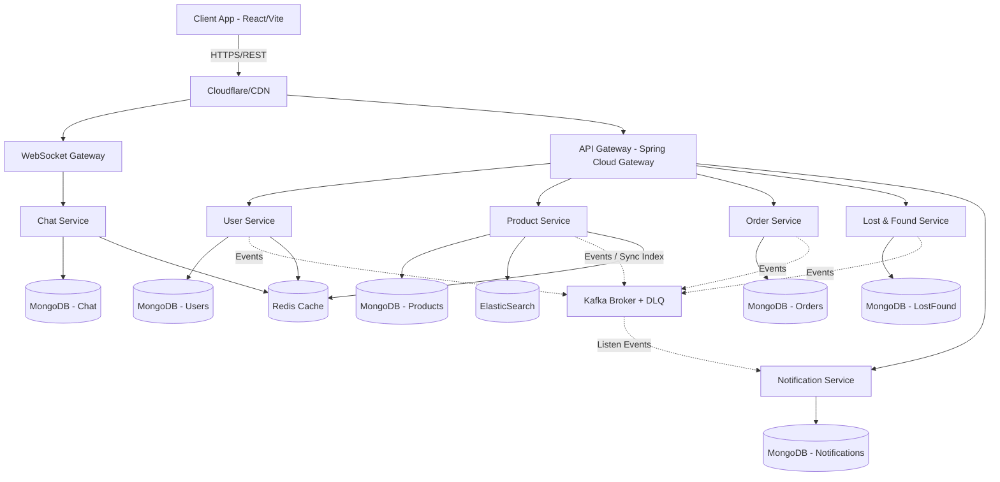
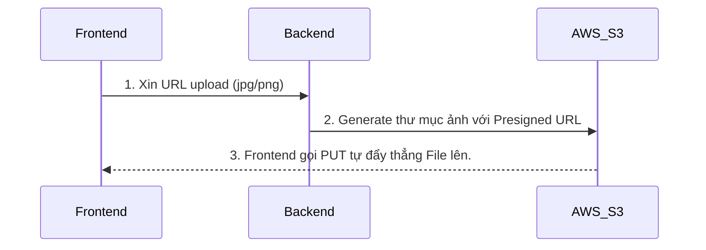

# 🏫 IUH Campus Exchange Platform - System Design Document

Tài liệu này mô tả chi tiết thiết kế hệ thống cho ứng dụng **IUH Campus Exchange Platform** nhằm đáp ứng tất cả các nghiệp vụ mua bán, trao đổi, đồ thất lạc và xây dựng cộng đồng trong khuôn viên trường.

---

## 1. Kiến trúc tổng thể (Architecture Design)

Hệ thống được thiết kế theo kiến trúc **Microservices** để đảm bảo khả năng mở rộng, dễ bảo trì và phân tách rõ ràng trách nhiệm nghiệp vụ.

### Sơ đồ Kiến trúc Microservices



**Các thành phần Core của hệ thống:**
- **API Gateway:** Routing, Rate Limiting (Redis), Auth Filter, Circuit Breaker, Request Logging.
- **WebSocket Gateway (Mới):** Cánh cổng xử lý các kết nối WebSocket riêng biệt, cho phép Chat Service scale dễ dàng ra nhiều instances với Sticky Sessions hoặc phân phối qua Redis Pub/Sub.
- **Message Broker (Kafka):** Điều phối sự kiện Event-Driven, sử dụng **Dead Letter Queue (DLQ)** cho các event gặp sự cố.
- **Cache Layer (Redis):** Caching Product list, User Profiles, Hot items và trạng thái phiên Chat.
- **Search Engine (ElasticSearch):** Xử lý Fuzzy/Full-text Search siêu tốc độ.

---

## 2. Database Design (MongoDB) & Role-Based Access Control

Mỗi service sở hữu Database Collection riêng biệt.

### User Service (`users` & RBAC)
Ngăn chặn các quy chuẩn ROLE chung chung, phân chia chi tiết các `permissions`.
```json
{
  "_id": "ObjectId",
  "email": "student_id@student.iuh.edu.vn",
  "passwordHash": "BCrypt string",
  "name": "Nguyễn Văn A",
  "isVerified": true, 
  "karmaPoint": 150,
  "role": "STUDENT", // Có thể là ADMIN, MODERATOR
  "permissions": ["CAN_POST", "CAN_CHAT", "CAN_REPORT"] // ADMIN sẽ có CAN_BAN, CAN_APPROVE_POST
}
```

### Product Service (`products`)
```json
{
  "_id": "ObjectId",
  "sellerId": "UserId",
  "name": "Sách Toán Rời Rạc",
  "description": "Sách còn mới 90%",
  "price": 50000, 
  "status": "AVAILABLE" 
}
```

### Data Sync Strategy qua ElasticSearch (Event-Driven)
Tuyệt đối KHÔNG ghi đồng thời (Dual-write) vì rất nguy hiểm (dễ mất đồng bộ nếu 1 trong 2 ghi lỗi).
- Quy trình chuẩn: `ProductService` ghi data xuống `MongoDB` -> Produce sự kiện `ProductCreatedEvent` gửi lên Kafka -> *ElasticSearch Indexer (hoặc 1 consumer)* bắt event và Cập nhật Data vào `ElasticSearch`. 

---

## 3. API Design & Distributed System Standards

Thiết kế theo chuẩn RESTful được bọc qua Gateway.

### Xử lý Phân trang & Sắp xếp (Pagination + Sorting)
*Toàn bộ API Listing phải được Pagination từ đầu.*
- `GET /api/v1/products?page=1&size=20&sort=price,asc` (Lấy trang 1, 20 món/trang, sắp xếp giá tăng dần).

### Giải quyết tính Idempotency (Chống Trùng Lặp)
Ví dụ: User spam click "Mua" hoặc Kafka replay lại event làm tạo nhiều đơn hàng giống nhau.
- **Xử lý:** Mọi POST request thay đổi trang thái quan trọng bắt buộc kèm theo **`Idempotency-Key`** trên Header. Service sẽ check trong Redis xem UID này đã thực hiện thành công chưa trong vòng 24 giờ.
- **DB Constraint Add-on:** Tạo composite unique index ở MongoDB kết hợp `buyerId + productId + status=PENDING` chặn 2 đơn đặt cùng lúc.

### Xử lý Giao dịch lỗi (Dead Letter Queue & Retry)
1. Trong Kafka Event Driven (ví dụ: Tạo Notification) nếu Service bị ngoại lệ, request được đưa vào chính sách **Retry qua Exponential Backoff** (thử lại tăng dần thời gian).
2. Nếu Retry vượt ngưỡng max limit -> Event rơi vào **DLQ (Dead Letter Queue)**, chờ Admin xử lý hoặc lưu cảnh báo riêng thay vì bị "nuốt" thầm lặng.

### Xử lý Distributed Transaction (Saga Pattern)
1. `OrderService` ghi db tạo Order dạng `PENDING` -> Bắn Event `OrderCreatedEvent`.
2. `ProductService` lắng nghe Event -> Đổi status sản phẩm sang `PENDING`.
3. LỖI -> `ProductUpdateFailedEvent`.
4. `OrderService` nghe lỗi -> Tiến hành **Compensating Transaction** Roleback Order về `CANCELLED`.

---

## 4. Scalable Chat & Notification Strategy

### 4.1 Chat Service riêng biệt với Scale Strategy
Khi Chat Service scale ra N-instances, sẽ có luồng hai máy người dùng kết nối Websocket chéo nhau không nói chuyện được.
- **Giải quyết:** Sử dụng **WebSocket Gateway riêng biệt** làm proxy điều phối kết nối. Khi kết nối, gắn thiết lập **Sticky Session** hoặc kết nối qua **Redis Pub/Sub** (Khi Client A nhắn B, nếu B trên instance khác -> Gửi Message vào Redis Channel của B).

### 4.2 Notification Service theo Type
- **In-app Notification:** Hiển thị tức thời qua Websocket, lưu DB để đọc lịch sử.
- **Email Notification:** Dùng cho OTP, Hóa đơn thành công.
- **Push Notification:** Dùng Firebase Cloud Messaging để Alert Mobile User.

---

## 5. Security & Tự Động Kiểm Duyệt (Moderation)

### Bức tường phòng thủ bảo mật (Security):
- **Authentication Flows:** Access Token ngắn hạn & Refresh Token trong `HttpOnly Cookie`. 
- **Bảo mật Spam:** Giới hạn Login Limit bằng Redis (chống Brute-force mật khẩu). Mật khẩu hoàn toàn phải Hash với thuật toán mã hóa **BCrypt**.

### Tự động kiểm duyệt (Anti-spam / Moderation):
- **Blacklist Keyword Filter:** Phát hiện nội dung đăng bài hoặc chat có các từ ngữ cấm (VD: văng tục, lừa đảo, số điện thoại spam) API chặn lưu ngay ở Validation filter.
- **Cơ chế Report:** Có Endpoint cung cấp tính năng tố cáo (`POST /api/v1/reports`). User có thể Report lẫn nhau hoặc Report 1 User có dấu hiệu lạ.
- Hệ thống trừ **KarmaPoint**. Giảm xuống dưới ngưỡng nhất định sẽ tự động rớt Role `CAN_POST` ngăn không cho post lừa đảo hàng loạt.

---

## 6. Frontend Design (ReactJS)

Sử dụng **ReactJS + Vite**. Tích hợp **TailwindCSS** + **Shadcn/UI**.

**Cấu trúc thư mục:**
```
src/
├── components/     # Component tái sử dụng (ChatBox, Modal, ProductCard)
├── hooks/          # useAuth, useWebSocket, useDebounce (cho call search ES)
├── pages/          
│   ├── Marketplace/# Trang xem và tìm sản phẩm
│   ├── LostFound/  # Trang mạng hiển thị bảng lạc đồ
│   ├── Admin/      # Giao diện cho Admin (Duyệt/Quản lý Report)
│   ├── Messages/   # Giao diện Chat độc lập
├── services/       # axios instance interceptor (Bơm refresh token tự động)
├── store/          # Zustand store (Global states)
```

---

## 7. Upload Image (AWS S3 Presigned URL)

Để giảm tải Backend, chỉ dùng Client-side Direct Upload:



---

## 8. Logging, Monitoring & Caching (Production-ready)

Hệ thống phải được quan sát để không gặp rủi ro rớt mạng âm thầm.

- **Caching Layer:** Redis được ứng dụng rộng rãi dọc theo Product/User info.
- **Centralized Logging (ELK Stack):** Elasticsearch + Logstash + Kibana truy vết log file JSON cấu trúc sẵn.
- **Metrics Monitoring:** **Prometheus + Grafana**. Quan sát được Request/s, API bị nghẽn JVM memory, CPU Usage.

---

## 9. Scaling & Deployment

- **Containerization (Docker):** Toàn bộ stack được docker hóa độc lập.
- **CI/CD:** Sử dụng GitHub Actions pipeline.
- **Deployment Platform:** EC2/EKS (K8S), **MongoDB Atlas**, **AWS Elasticache (Redis)**.
